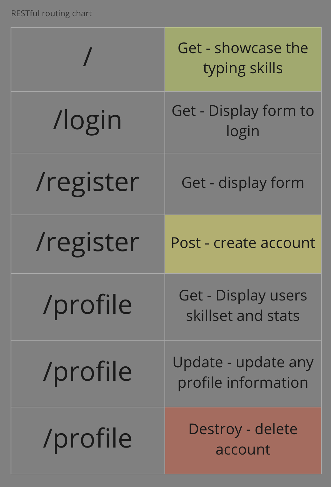

# Swift Clicks

The world is advancing and it is now a common skill to learn how to type. This software is going to be used to develop typing skills for the next generation. Keep up with innovation and start off with a few swift clicks.

## Deploy link
TBD

## Wireframe

## RESTFUL routing chart 
<!-- List of links -->

## ERDs
<!-- Relationships -->

## API

## General Approach

## Technologies Used
- TypeScript
- Node.js
- Express.js
- MongoDB
- Mongoose
- JSON Web Token
- JWT decode
- React

## User Stories
- As a user, I want a prompt that I can use to practice typing.
- As a user, I want to be able to see my results after my practice.

## MVP
- Use an API to generate a prompt for the users to type the description
- Finish the testing process once the user has typed out the prompt

## Stretch goals
- Display all the stats on the users testing process
- Make it have a nice user interface 